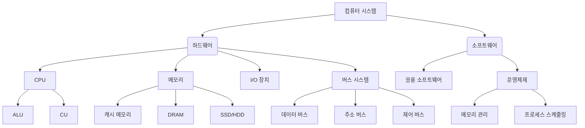
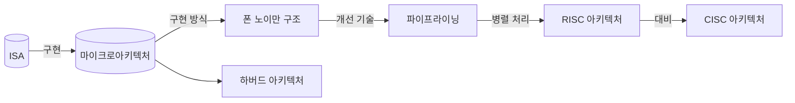

# 컴퓨터 구조 (Computer Architecture)
## 개요
컴퓨터 시스템은 하드웨어와 소프트웨어가 상호작용하는 방식을 정의한 구조적·기능적 설계 체계로, 성능·효율성·확장성을 결정하는 핵심 분야이다. 주요 구성 요소로는 CPU, 메모리, 입출력 장치, 버스 시스템이 포함된다.

## 정의
- **컴퓨터 아키텍처**: 시스템의 기능적 동작을 정의하는 추상적 사양
- **마이크로아키텍처**: [[컴퓨터 조직]]에서 실제 구현 방식을 기술
- **ISA(Instruction Set Architecture)**: CPU가 이해하는 명령어 집합 체계

## 주요 내용
- **폰 노이만 구조**: [[폰 노이만]]이 제안한 프로그램 내장 방식 저장장치
- **하버드 아키텍처**: 명령어와 데이터 버스를 분리한 고성능 설계
- **파이프라이닝**: 명령어 처리 단계 중첩을 통한 성능 향상 기술
- **캐시 메모리**: [[메모리 계층]] 구조를 활용한 접근 속도 개선
- **RISC vs CISC**: [[RISC 아키텍처]]와 복잡한 명령어 집합의 설계 철학 비교

## 특징/구성요소
- **CPU 코어**: 산술논리장치(ALU), 제어장치(CU) 포함
- **메모리 계층**: 레지스터 → 캐시 → DRAM → SSD/HDD
- **병렬 처리**: 멀티코어·SIMD·MIMD 구현 방식
- **버스 시스템**: 데이터·주소·제어를 위한 시스템 버스 구조

## 활용/적용
- 임베디드 시스템: 실시간 제어에 최적화된 하드웨어 설계
- 슈퍼컴퓨터: 벡터 처리와 병렬화 기술을 활용한 고성능 컴퓨팅
- 모바일 장치: 전력 효율 중심의 SoC(System on Chip) 구현

## 관련 항목
[[컴퓨터 조직]] | [[메모리 계층]] | [[RISC 아키텍처]] | [[폰 노이만]] | [[파이프라이닝]]
---
Tags: #컴퓨터과학 #하드웨어 #시스템설계

![[Pasted image 20260112133512.png]]![[Pasted image 20260112134026.png]]

## 시각화된 컴퓨터 구조

